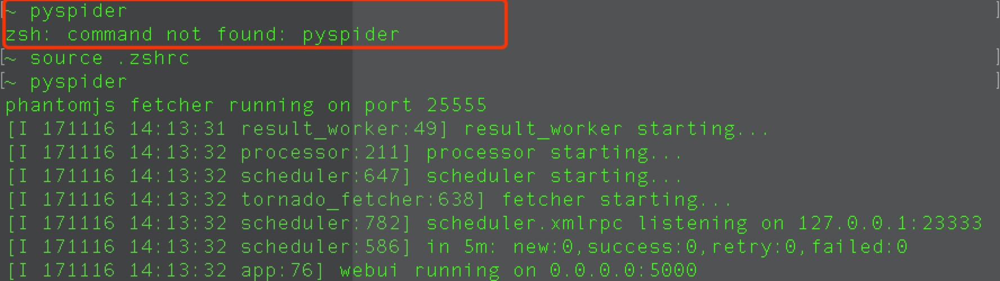

`pyspider`的安装
==

- 版本 python3.5
- 安装方式 pip
- 操作系统 Mac OS

----
1. 执行命令 `pip3 install pyspider`
2. 安装之后执行 `pyspider`
3. 浏览器打开  `http;//localhost:5000`

问题：

在我执行`pyspider`时提示我`command not found pyspider`?

解决方式：

配置`pyspider`的环境变量，然后 `source`就OK了.